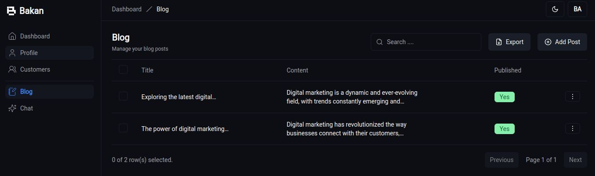

# Bakan ~ Next.JS App Router



## Environment Variables

```bash
NEXT_PUBLIC_SITE_URL="http://localhost:3000"
DATABASE_URL=""
AUTH_SECRET=""
UPSTASH_REDIS_REST_URL=""
UPSTASH_REDIS_REST_TOKEN=""
OPENAI_API_KEY=""

#google
AUTH_GOOGLE_ID=""
AUTH_GOOGLE_SECRET=""
NEXT_PUBLIC_GA_MEASUREMENT_ID=""

#stripe
NEXT_PUBLIC_STRIPE_PUBLIC=""
STRIPE_SECRET_KEY=""
STRIPE_WEBHOOK_SECRET=""

#resend
RESEND_API_KEY=""
RESEND_FROM_EMAIL="Bakan <onboarding@resend.dev>"
```
